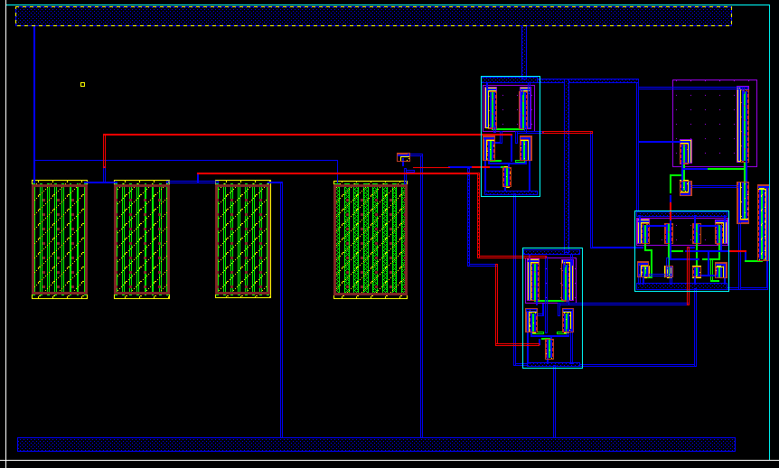
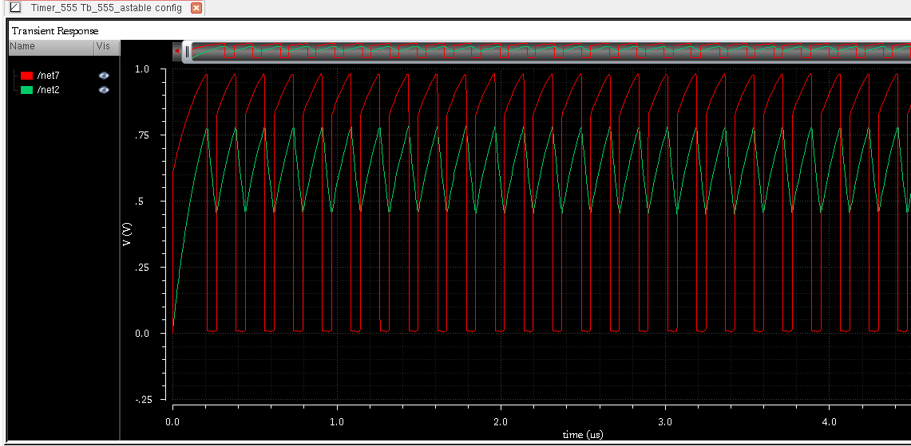
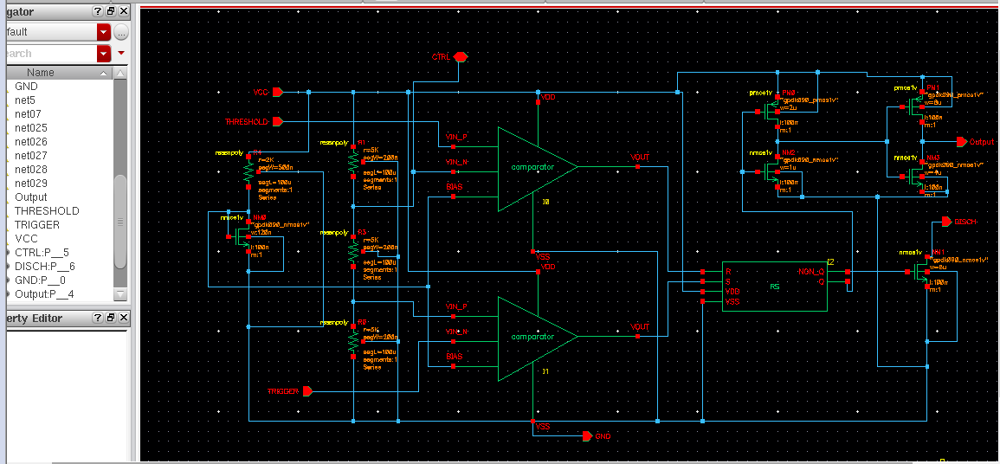
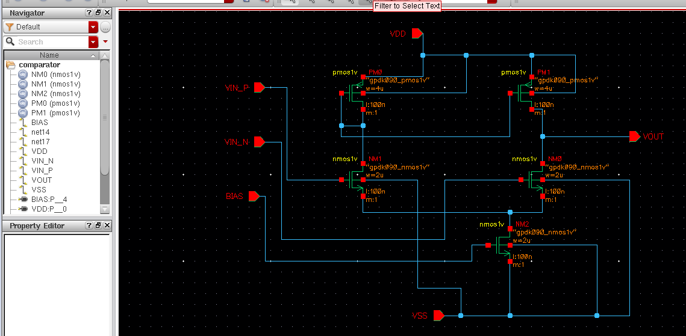
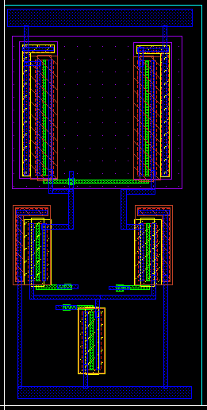
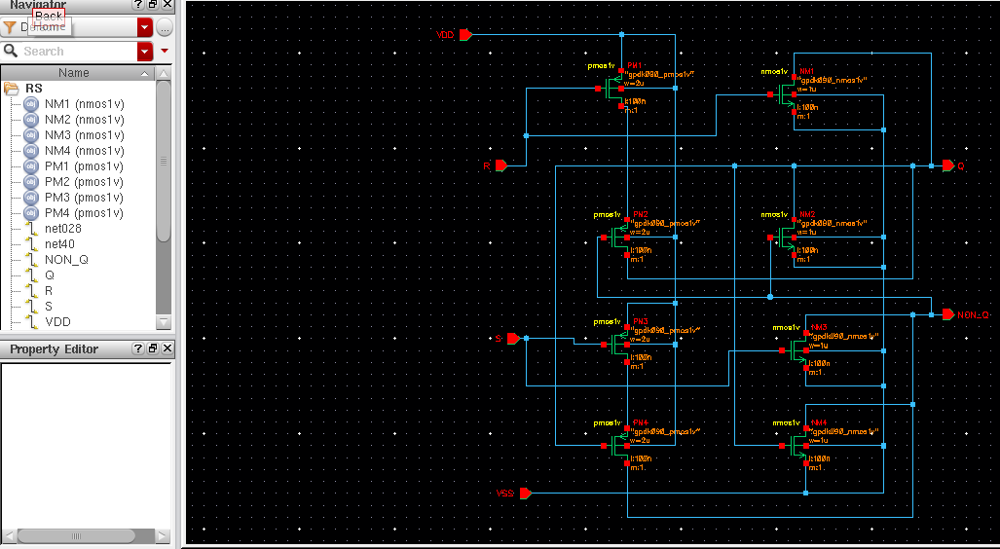
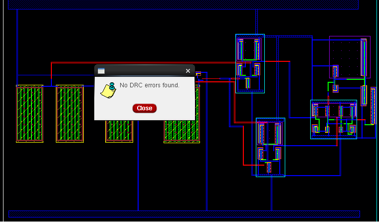
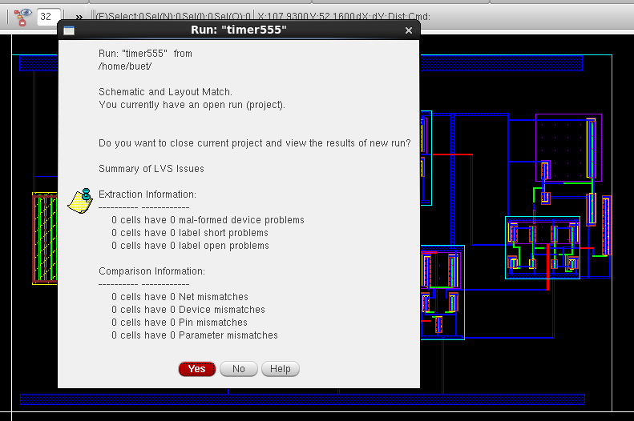
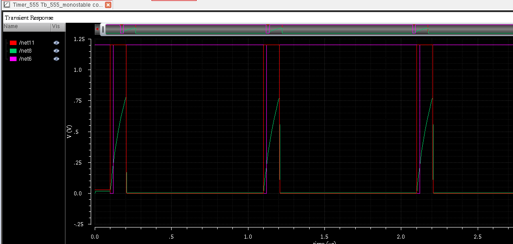

# Full-Custom Mixed-Signal NE555 Timer IC in 90nm CMOS


-purple?style=flat-square)


Full-custom transistor-level design, physical layout, parasitic extraction (PEX), and post-layout sign-off simulation of an NE555 Mixed-Signal Timer IC. Designed and verified in **Cadence Virtuoso** using the **GPDK 90nm CMOS** technology library operating at a nominal supply of $V_{DD} = 1.2\text{ V}$.

<p align="center">
  
  
</p>

---

## Key Hardware & Physical Highlights (Sign-off)

* **Closed-Loop Physical Sign-Off:** Full design flow completed from transistor sizing, full-custom physical layout, **Assura DRC Clean** (0 violations), and **Assura LVS Clean** with zero net/device mismatches.
* **Parasitic-Aware Sign-Off:** Extraction completed via **Assura RCX** generating parasitic-annotated `av_extracted` views; simulations validated under **Spectre** via Cadence Hierarchy Editor (`config` view).
* **Calibrated Switching Thresholds:** Integrated high-matching 3-stage precision resistive voltage divider providing switching hysteresis boundaries at $\frac{1}{3}V_{DD} = 0.4\text{ V}$ (Trigger) and $\frac{2}{3}V_{DD} = 0.8\text{ V}$ (Threshold).
* **Dual Operational Modes:** Sign-off transient verification confirms robust rail-to-rail operation in both continuous **Astable** (relaxation oscillator) and edge-triggered **Monostable** pulse generation under post-layout parasitic extraction.

---

## Top-Level Circuit Architecture

The complete NE555 timer architecture integrates a reference ladder, dual differential comparators, an SR flip-flop latch, and an open-drain discharge stage sized for fast capacitor reset.

<p align="center">
  
</p>

---

## Architectural Sub-Blocks (Schematic & Layout)

### 1. Analog Differential Comparator
High-gain differential pair architecture comparing external input pins (`TRIGGER`, `THRESHOLD`) against internal reference divider nodes with fast output transitions.

<p align="center">
  
  
</p>

### 2. Bistable SR Latch
High-speed cross-coupled bistable multivibrator driving the internal switching state and holding output values during timing phases.

<p align="center">
  
  
</p>

---

## Physical Verification (Sign-off)

Full physical sign-off achieved via Assura design rule checker and layout-versus-schematic verification decks with zero remaining errors.

| Verification Stage | Tool | Status | Results Summary |
| :--- | :--- | :---: | :--- |
| **Design Rule Check (DRC)** | Assura DRC | **PASS** | 0 DRC Errors across all GPDK 90nm mask layers |
| **Layout vs. Schematic (LVS)** | Assura LVS | **PASS** | Schematic and Layout are fully matched |
| **Parasitic Extraction (PEX)** | Assura RCX | **PASS** | Generated parasitic `av_extracted` view |

<p align="center">
  
  
</p>

---

## Post-Layout Simulation Results

Transient simulations performed under **Spectre** using the `av_extracted` view linked via Cadence Hierarchy Editor (`config`).

### 1. Monostable Pulse Generator Mode
Triggered by an active-low pulse below $\frac{1}{3}V_{DD}$ ($0.4\text{ V}$). The output latches HIGH while the external capacitor charges exponentially toward $\frac{2}{3}V_{DD}$ ($0.8\text{ V}$), triggering comparator reset and discharging the timing node back to ground.

<p align="center">
  
</p>

### 2. Astable Multivibrator Mode (Free-Running Relaxation Oscillator)
Autonomous square-wave oscillation operating continuously between switching limits $[0.4\text{ V}, 0.8\text{ V}]$. Output exhibits full rail-to-rail swing ($0.0\text{ V} \to 1.2\text{ V}$) with minimal parasitic skew.

<p align="center">
  
</p>

---

## Performance Summary Table

| Metric / Parameter | Value | Unit | Condition |
| :--- | :---: | :---: | :--- |
| **Technology Node** | 90 | nm | GPDK090 CMOS |
| **Supply Voltage ($V_{DD}$)** | 1.2 | V | Nominal |
| **Lower Trigger Threshold ($V_{TRIG}$)** | 0.40 ($\frac{1}{3}V_{DD}$) | V | Precision Resistor Divider |
| **Upper Threshold ($V_{TH}$)** | 0.80 ($\frac{2}{3}V_{DD}$) | V | Precision Resistor Divider |
| **Output Voltage Swing** | $0.0 - 1.2$ | V | Rail-to-Rail |
| **Physical Sign-Off** | Clean | - | DRC = 0, LVS = Matched, RCX = Done |

---

## Repository Structure

```text
.
├── cds.lib                 # Cadence library definition
├── .gitignore              # Filters locks (*.cdslck), temp logs & simulation runs
├── docs/                   # Waveforms, layout captures, and verification reports
└── Timer_555/              # Cadence Virtuoso Library
    ├── comparator/         # Differential comparator (sch, sym, layout, av_extracted)
    ├── RS/                 # Bistable latch cell
    ├── voltage_divider/    # Matched reference ladder & extracted views
    ├── Tb_555_astable/     # Astable testbench (schematic & config)
    └── Tb_555_monostable/  # Monostable testbench (schematic & config)
